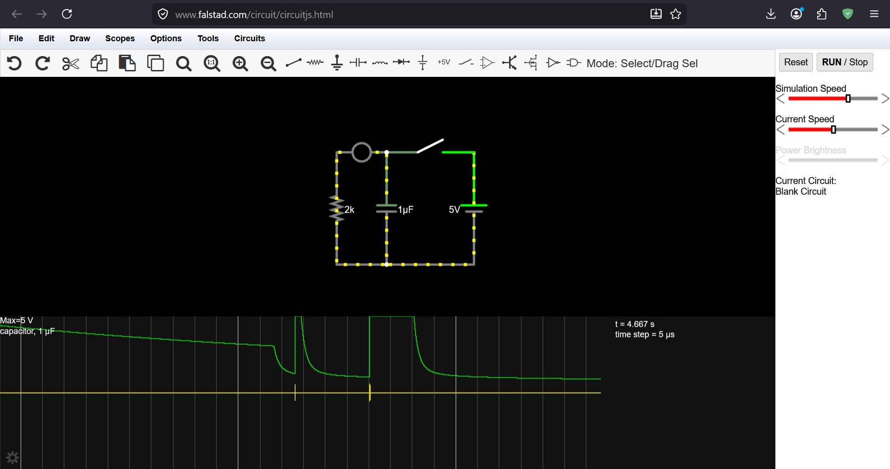
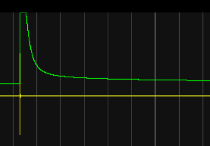
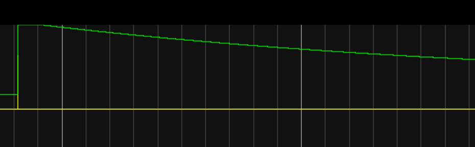
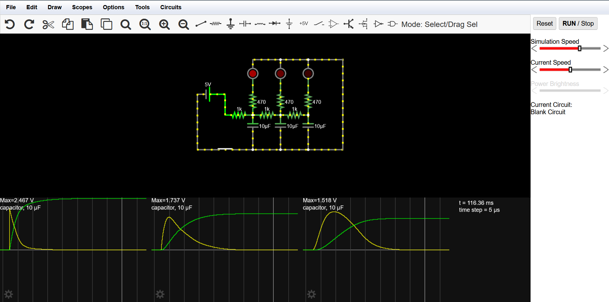
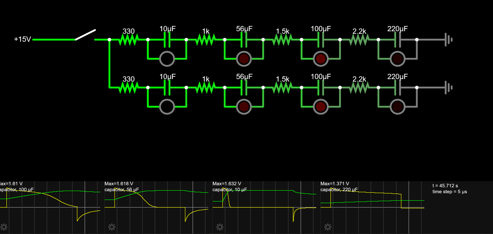
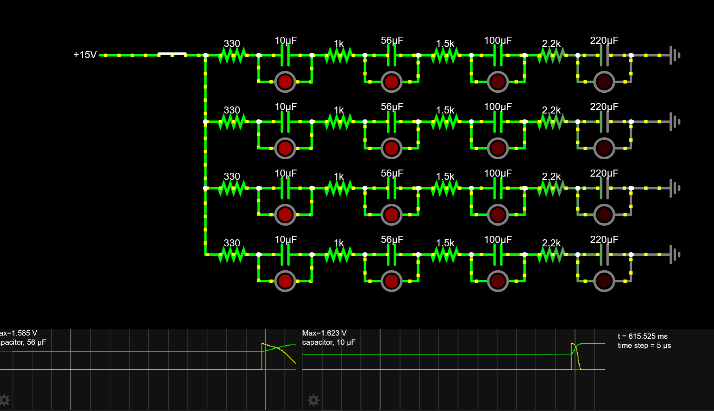

# RC Breathing Diodes

Building an LED matrix that fades using RC timing to understand how capacitors control time and how one analog signal can drive multiple outputs (no microcontrollers).

---

## 12/04/2026 - RC Basics

- Learned capacitor charge/discharge behavior
- Smooth voltage transitions instead of instant ON/OFF  

**Insights:**
- ↑R or ↑C → slower response  
- RC = analog timing  

**Tested:**  
- 2kΩ + 1µF → fast  
- Higher values → slower  

  

Time: 0.5h

---

## 12/04/2026 - Single Breathing LED

- Built RC fade circuit  
- Smooth fade-in and fade-out works  

**Issue:**  
- Not continuous (manual trigger needed)  

**Learning:**  
- RC ≠ oscillation  

Time: 0.5h

---

## 12/04/2026 - Continuous Behavior

- Tried multiple RC loops  

**Issue:**  
- LEDs synced too much  

**Insight:**  
- Need isolation per stage  
- Delays must be designed, not random  

Time: 0.5h

---

## 15/04/2026 - RC Chain Breakthrough

- Built multi-stage RC ladder  

**Result:**  
- Natural delay between LEDs  
- Wave-like effect  

**Key points:**  
- Voltage drop creates timing offsets  
- Capacitor size controls lag  

Time: 0.5h

---

## 15/04/2026 - Parallel Expansion

- Added second RC chain  

**Issue:**  
- Both rows looked identical  

**Fix:**  
- Vary R and C values  

**Learning:**  
- Variation = better visuals  

Time: 0.5h

---

## 16/04/2026 - 1X4 Matrix

- Used increasing R & C values  

**Result:**  
- Clear signal propagation (left → right)  

**Insight:**  
- Acts like analog delay line  
- Bigger caps = slower response  

Time: 0.5h

---

## 16/04/2026 - 4x4 Matrix Plan (J4.0)

**Goal:**  
- Full 4x4 LED matrix using only RC  

**Direction:**  
- "Breathing wave matrix"  

Time: 0.5h
